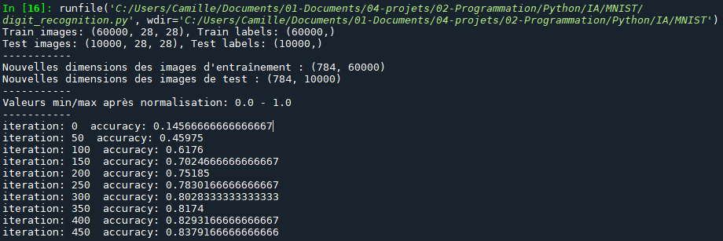
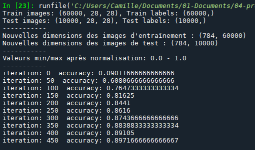
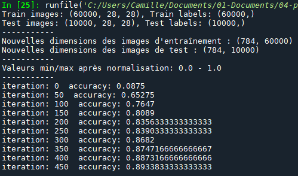

# Project: Handwritten Digit Recognition with a Neural Network

## 📌 Description
This project implements a neural network to recognize handwritten digits using the MNIST dataset. It uses Python and NumPy to train a simple model without deep learning frameworks.

## 📂 Project Contents
- `digit_recognition.py`: Main script that loads data, trains the network, and tests accuracy.
- `accuracy_plot.png`: Screenshot of the console illustrating accuracy evolution (generated after training).

## 📥 Data Preparation
The MNIST dataset is used for training. The images are:
- Loaded in IDX3-UBYTE format.
- Normalized between 0 and 1.
- Converted into 784-element vectors.
- Labels are converted to one-hot encoding.

## 🧠 Model Architechtures
### Original
The neural network consists of:
- **A hidden layer** with 10 neurons and *Leaky ReLU* activation.
- **An output layer** with 10 neurons and *softmax* activation.

Here is the accuracy evolution during training:

### Wide Network
The neural network consists of:
- A hidden layer with **392** neurons and *Leaky ReLU* activation.
- A hidden layer with **64** neurons and *Leaky ReLU* activation.
- An output layer with **10** neurons and *softmax* activation.

Here is the accuracy evolution during training:

### Deep Network
The neural network consists of:
- A hidden layer with **124** neurons and *Leaky ReLU* activation.
- A hidden layer with **64** neurons and *Leaky ReLU* activation.
- A hidden layer with **32** neurons and *Leaky ReLU* activation.
- An output layer with **10** neurons and *softmax* activation.

Here is the accuracy evolution during training:

## Conclusion
This project enabled us to see how to classify data into more than two categories using the softmax function. We tried different achitechtures and it seems that the wider and deeper the network, the better the results. However, this also implies a longer training time and the gain is not as great as we expected. Perhaps we could look at more complex architectures or work with different data processing.

## 📜 References
- MNIST Dataset: [https://github.com/cvdfoundation/mnist](https://github.com/cvdfoundation/mnist?tab=readme-ov-file)
- Model Inspiration: [YouTube Video](https://www.youtube.com/watch?v=w8yWXqWQYmU)

---
👨‍💻 **Author: Camille ANSEL**  
📅 **Date: 03/02/2024**

